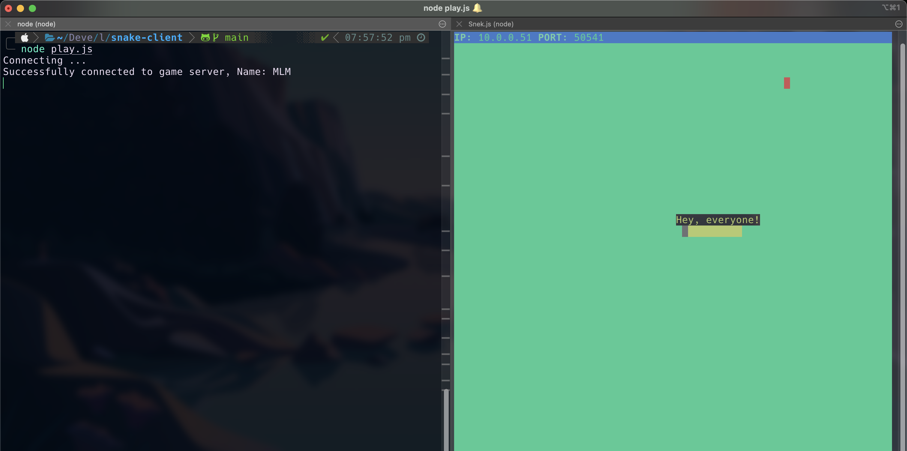

# Snake Client Project

Snake game is a very popular video game. It is a video game concept where the player maneuvers a dot and grows it by ‘eating’ pieces of food. As it moves and eats, it grows and the growing snake becomes an obstacle to smooth maneuvers. The goal is to grow it to become as big as possible without bumping into the side walls, or bumping into itself, upon which it dies.

This is simply a multiplayer take on the genre.

Before you can run this client, you will need to be running the server side which you can download and install from here. 

## Final Product

* Here is a screenshot of both server and client running in one terminal window. (Please note, I am using iTerm2 as well as a custom color theme. Style will vary depending on your own specs.)

## Getting Started

- Follow steps inside the snek server repo to run the server side
- Run the development snake client using the `node play.js` command.

## Fun Features
While the game is running:
- Hit the 'G' key for your snake to say "GGs" (which is short for good game - sportsmanship is always nice!)
- Hit the 'H' key for your snake to say "Hey, everyone!" If there are other players connected. This is a multiplayer take on it after all!
- Hit the 'M' key for your snake to say "Git gud" a cheeky little way of letting someone know to do better!